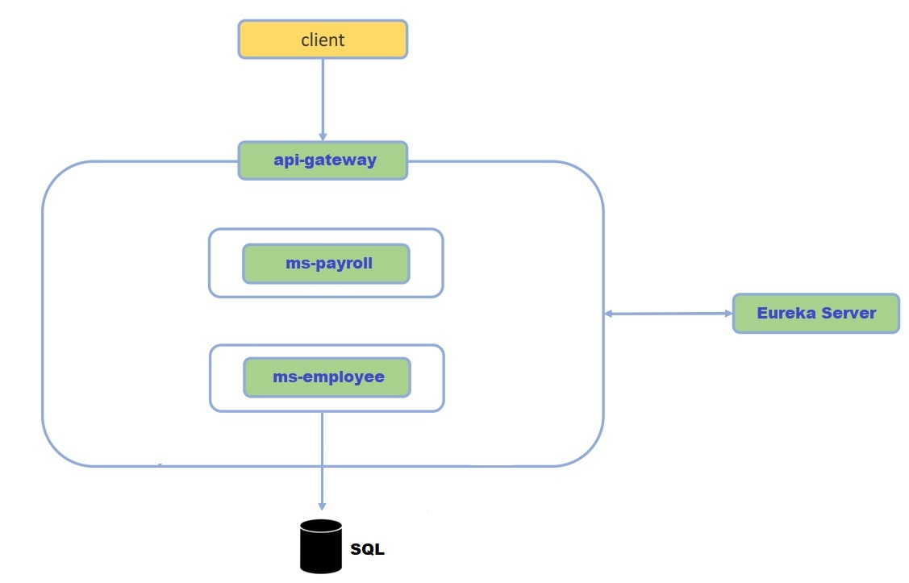

<div align="center">
  <a></a>
</div>

# ForgeHR
O projeto ForgeHR foi construido sobre a arquitetura de microserviços, empregando o conjunto de ferramentas
robustas do Spring Cloud. A finalidade é torna o sistema escalável, flexível e mais fácil de manter.

## Ilustração da Arquitetura

<div align="center">
  <a></a>
</div>

### Employee
```markdown
GET /employee - listar funcionários.

GET /employee/{id} - recuperar funcionário.
```

### Payment
```markdown
GET /payment/{employeeId}/days/{days} - recuperar folha de pagamento.
```

## Dependecias Utilizadas:
- spring-boot-starter-web
- spring-boot-starter-data-jpa
- h2 (com.h2database)
- lombok
- spring-cloud-starter-netflix-eureka-server
- spring-cloud-starter-netflix-eureka-client
- spring-cloud-starter-gateway
- spring-cloud-starter-openfeign
